# Modèle Conceptuel de Données (MCD) - Chroniques Oubliées Fantasy

Ce document présente le modèle de données complet nécessaire pour couvrir l'ensemble des règles de Chroniques Oubliées Fantasy (Version 2), incluant les peuples, profils, voies, capacités, sorts et équipements.

## Diagramme de Classes (Mermaid)

```mermaid
classDiagram
    %% Relations principales
    Race "1" -- "1" RacialVoie : possède
    Profile "1" -- "*" Voie : donne accès à
    Profile "1" -- "1" Family : appartient à
    Voie "1" -- "5..*" Capability : contient
    Character "1" -- "1" Race : est un
    Character "1" -- "1" Profile : a un métier
    Character "*" -- "*" Capability : apprend
    Character "*" -- "*" Equipment : possède
    Creature "1" -- "1" CreatureFamily : appartient à
    Creature "1" -- "1" CreatureFamily : appartient à
    Creature -- "*" Voie : possède (rangs)
    Character -- "*" Condition : affecté par
    Character "1" -- "*" God : prie (Prêtre)
    Character "1" -- "*" MagicItem : possède
    Character "1" -- "*" Language : parle (Langues connues)
    Character -- "*" Building : possède (Immobilier)
    Character "1" -- "*" Language : parle (Langues connues)
    Character -- "*" Building : possède (Immobilier)
    Character -- "*" Faction : membre de
    Character -- "*" Quest : participe à
    Character -- "1" Quirk : traits de personnalité
    Character -- "1" PregenCharacter : basé sur (optionnel)

    %% Entités détaillées

    class Quirk {
        +String ideal
        +String flaw
        +String secret
        +String secondaryTalent
    }

    class PregenCharacter {
        +String name
        +String description
        +String raceId
        +String profileId
        +Integer level
    }

    class Faction {
        +String id
        +String name
        +String description
        +String type
    }

    class Quest {
        +String id
        +String name
        +String type
        +List~Scene~ scenes
        +Reward reward
    }

    class CraftingRule {
        +String itemType
        +Integer difficulty
        +Float costMultiplier
        +Float timeMultiplier
    }

    class Language {
        +String id
        +String name
        +String speakers
        +String alphabet
    }

    class Building {
        +String id
        +String name
        +String type
        +Integer rooms
        +String price
    }

    class MagicItem {
        +String id
        +String name
        +String type
        +String rarity
        +String effect
        +String price
    }

    class Hazard {
        +String id
        +String name
        +String type
        +String damage
        +String effect
        +Integer detectionDC
        +Integer disarmDC
    }

    class TacticalOption {
        +String id
        +String name
        +String description
        +String effect
        +String condition
    }

    class CreatureTemplate {
        +Integer nc
        +Integer hp
        +Integer def
        +Integer atk
        +Integer dmg
    }

    class God {
        +String id
        +String name
        +String alignment
        +String domains
        +String symbol
        +String sacredWeaponId
        +String divineCapabilityId
    }

    class Condition {
        +String id
        +String name
        +String description
        +String durationType
        +Effect effect
    }

    class Effect {
        +String damage
        +String healing
        +String duration
        +String save_stat
        +String save_threshold
        +List~String~ summonedCreatureIds
    }

    class Material {
        +String id
        +String name
        +Double priceMultiplier
        +Effect effect
    }

    %% Entités détaillées

    class Race {
        +String id
        +String name
        +String description
        +List~StatMod~ modifiers
        +String size
        +String speed
        +String language
        +String racialVoieId
    }

    class Family {
        %% Famille de profil (Aventurier, Combattant, Mage, Mystique)
        +String id
        +String name
        +String description
        +Integer baseHP
        +String recoveryDie
        +Integer luckPoints
        +String manaStat
    }

    class Profile {
        +String id
        +String name
        +String description
        +String note
        +String familyId
        +String hitDie
        +List~String~ weaponsAuth
        +List~String~ armorAuth
        +Integer skillPoints
        +String magicStat
    }

    class Voie {
        +String id
        +String name
        +String description
        +String category
        +String profileId
        +String type
        +Integer maxRank
    }

    class Capability {
        %% Couvre Capacités et Sorts
        +String id
        +String name
        +String description
        +String voieId
        +Integer rank
        +Boolean isSpell
        +String actionType
        +String range
        +String duration
        +Boolean limited
        +Effect effect
        +List~String~ summonedCreatureIds
    }

    class Equipment {
        +String id
        +String name
        +String description
        +String type
        +String price
        +Float weight
        +String rarity
        +String materialId
        +String quality
    }

    class Service {
        +String id
        +String name
        +String price
        +String type
    }

    class Vehicle {
        %% Remplace/Generalise Mount
        +String id
        +String name
        +String type
        +String price
        +Integer capacity
        +Stats stats
    }

    class Weapon {
        %% Hérite de Equipment
        +String damage
        +String crit
        +String range
        +String hands
        +String reload
        +List~String~ properties
    }

    class Armor {
        %% Hérite de Equipment
        +Integer acBonus
        +Integer maxDex
        +Integer penalty
        +String type
    }

    class CreatureFamily {
        +String id
        +String name
        +String description
        +String imageUrl
    }

    class Creature {
        +String id
        +String name
        +String creatureFamilyId
        +Integer nc
        +Integer hp
        +Integer def
        +Integer init
        +Stats stats
        +List~Capability~ specialAbilities
    }

    class Character {
        +String name
        +Integer level
        +Race race
        +Profile profile
        +Map~Stat,Val~ stats
        +Integer hp
        +Integer currentHp
        +Integer mana
        +Integer luck
        +List~Equipment~ inventory
    }

    %% Héritage (Mermaid ne supporte pas toujours bien l'héritage visuel propre, on utilise des notes ou liens)
    Equipment <|-- Weapon
    Equipment <|-- Armor

    %% Notes
    note for Capability "ActionType: L (Libre), A (Action), M (Mouvement), G (Gratuit), R (Réaction)"
    note for Voie "Category: Combat, Mage, Racial, Prestige"
```

## Dictionnaire des Données

### 1. Entités de Base (Règles)

#### Family (Famille de Profil)
Définit les statistiques de base liées au rôle général.
- `baseHP` : Points de Vie de base (ex: 5 pour Combattant).
- `recoveryDie` : Dé de récupération (ex: d10, d8).
- `luckPoints` : Points de Chance de base.

#### Profile (Profil/Classe)
Le métier du personnage.
- `hitDie` : Dé de Vie (souvent lié à la famille mais peut varier).
- `weaponsAuth` / `armorAuth` : Listes des équipements autorisés.
- `voies` : Liste des 5 voies principales associées.

#### Race (Peuple)
L'espèce du personnage.
- `modifiers` : Ajustements de caractéristiques (ex: Force +2).
- `racialVoieId` : Lien vers la Voie de Peuple spécifique.

#### Voie (Path)
Une progression thématique de capacités.
- `category` : Combat, Magie, Peuple, etc.
- `ranks` : Liste ordonnée des capacités (1 à 5, ou jusqu'à 8).

#### Capability (Capacité / Sort)
Une aptitude spécifique. Inclut les sorts.
- `isSpell` : Indique si c'est un sort (nécessite Mana/CD).
- `actionType` : Coût en action (L, A, M...).
- `limited` : Usage limité (ex: "1 fois par combat").

### 2. Équipement
Divisé en Armes, Armures et Objets divers.
- **Weapon** : Dégâts, Critique (ex: 19-20), Portée.
- **Armor** : Bonus CA, Malus d'armure.

### 3. Créatures
- `nc` : Niveau de Créature (Difficulté).
- `creatureFamilyId` : Lien vers la famille (ex: Aigles, Gobelins).

### 4. États & Conditions
- **Condition** : États préjudiciables (ex: Renversé, Aveuglé).
    - `effect` : Description mécanique de l'effet.
    - `duration` : Durée (Round, Minute, Combat).

### 5. Religion & Divinités
- **God** : Dieux du panthéon.
    - `alignment` : Alignement.
    - `sacredWeapon` : Arme de prédilection (lien vers Equipment/Weapon).
    - `divineCapability` : Capacité offerte aux prêtres.

### 6. Matériaux & Qualité
- **Material** : Matériaux spéciaux (ex: Mithral, Pnoulpe).
    - `priceMultiplier` : Coût additionnel.
    - `effect` : Bonus passif.
- `Equipment.quality` : (ex: "De maître", "Magique").

### 7. Services & Montures
- **Service** : Auberge, Nourriture, Soins.
    - `price` : Coût (en pa/pc/po).
- **Mount** : Montures (Chevaux, etc.).
    - `stats` : Utilise les stats de Créature (PV, DEF, etc.).

### 8. Objets Magiques & Environnement
- **MagicItem** : Potions, Parchemins, Armes magiques.
- **Hazard** : Pièges, Poisons, Chutes.
- **TacticalOption** : Manœuvres de combat (Renverser, Aveugler).
- **CreatureTemplate** : Règles de création de monstres par NC.

### 9. Lore & Immobilier
- **Language** : Langues parlées (ex: Elfique, Draconique).
    - `speakers` : Qui la parle (Peuple).
- **Building** : Biens immobiliers (Maison, Château).
    - `rooms` : Nombre de pièces.
    - `price` : Coût d'achat (po).
- **Faction** : Royaumes, Guildes, Organisations.
- **Quest** : Scénarios et quêtes.

### 10. Systèmes Avancés
- **CraftingRule** : Règles de fabrication (Difficulté, Coût).
- **Vehicle** : Montures et Véhicules (Chariot, Bateau).

### 11. Personnalité & Prétirés
- **Quirk** : Traits de caractère (Idéal, Travers, Secret, Talent secondaire).
- **PregenCharacter** : Personnages prêts à jouer (pour débutants).

