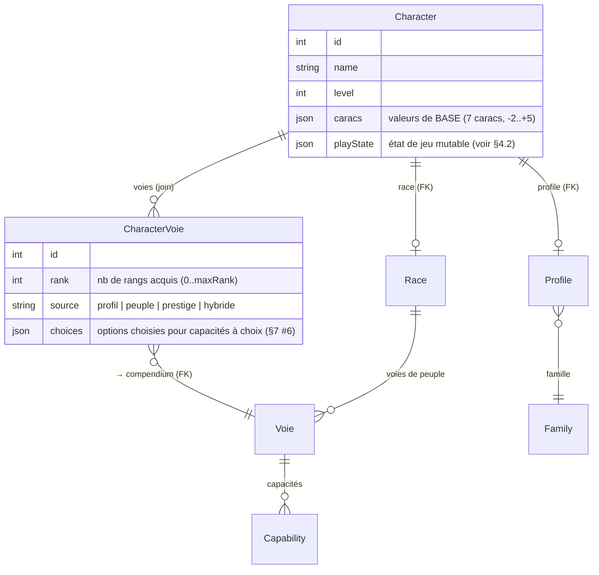

# Design — Refonte du modèle de données pour la fidélité aux règles COF2

- **Date :** 2026-07-12
- **Statut :** design validé, prêt pour le plan d'implémentation
- **Auteur :** nauno + Claude
- **Règles de référence :** `doc/getRulesFullToMD/` (font foi)

## 1. Contexte & objectif

Le compagnon COF2 doit être fidèle aux règles : c'est sa raison d'être. L'audit du
modèle de données révèle que la partie **personnage** n'a pas été conçue avec toutes
les règles en main. Le personnage est aujourd'hui un sac JSON informe
(`Character.data`) qui :

- **dédouble `stats` et `modifiers`** à la manière de D&D, alors qu'en COF2 la
  caractéristique **EST** le modificateur (échelle ‑2…+5) ;
- **stocke les valeurs dérivées** (PV max, DEF, Init, PM, valeurs d'attaque) au lieu
  de les recalculer, d'où un risque de divergence avec les entrées ;
- **référence les voies par nom** (`voies.profile: [{name, ranks[]}]`, tableau figé de
  5), sans lien relationnel au compendium — fragile aux renommages, incompatible avec
  les profils hybrides ;
- **ignore plusieurs concepts de règles** (nombre de DR, langues, idéal/travers,
  talent secondaire) et **n'a aucune notion de compagnon/invocation**.

**Objectif :** repartir sur un modèle où la fiche ne stocke que des **entrées**, où
tout le reste est **dérivé** par le moteur de règles, et où les références au
compendium sont **robustes** (relationnelles ou par IRI). Le schéma doit être conçu
dès maintenant pour accueillir les mécaniques spéciales des règles (compagnons,
transformations, états activables, usages limités…), quitte à en implémenter le calcul
de façon incrémentale.

## 2. Périmètre & non-objectifs

**Dans le périmètre :**

- Refonte complète du modèle `Character` (entités backend + types frontend).
- Contrat de dérivation dans `cofRules.ts` (source de vérité des calculs, côté front).
- Structuration des effets de capacités (`Capability.effect`) pour le calcul à l'écran.
- Réservation du schéma pour 9 familles de mécaniques spéciales (§7).
- Corrections du compendium nécessaires à des calculs justes (`Profile`, armures).
- Rupture nette du stockage (pas de migration de données existantes) + fixtures.

**Hors périmètre (cette passe) :**

- Bonus aux alliés / auras de zone (musique du barde, soins de zone) — relèvent du
  combat tracker / VTT, pas de la fiche solo.
- Peuplement exhaustif des effets sur-mesure de toutes les capacités (incrémental).
- Refonte du combat tracker et de la table virtuelle.
- Toute analytique/statistique concrète (on garantit seulement que le modèle la rend
  possible).

## 3. Décisions actées

| Décision | Choix retenu | Raison |
|----------|--------------|--------|
| Stockage des entrées | **Approche C (hybride)** : relations FK pour ce qui sera agrégé (peuple, profil, voies), JSONB pour l'état de jeu mutable | Fidélité + « faire des stats un jour » sur voies/profils/peuples, sans la lourdeur du tout-relationnel |
| Migration | **Rupture nette** : nouveau schéma + rechargement des fixtures, aucun script de conversion | Pas de données réelles à préserver (fiches de test uniquement) |
| Dérivation | **Côté frontend** (`cofRules.ts`), la fiche ne stocke que les entrées | L'infra de calcul existe déjà côté front ; le back reste déclaratif (API Platform) |
| Caractéristiques | **Valeurs uniquement** (‑2…+5), plus de champ `modifiers` séparé | La carac EST le modificateur en COF2 (§Caractéristiques des règles) |
| Effets de capacités | `Capability.effect` **structuré et tagué**, interprété progressivement, prose en fallback | Rendre calculable ce qui est formulaire sans devoir tout structurer d'un coup |
| Profil principal | **Fixé après la création** (mutable uniquement au niveau 0/1) ; acquérir des voies d'un autre profil = **hybride** (`source=hybride`), les anciennes voies sont conservées | Règles chap. 9 : le profil principal « ne peut pas être renié ». Remplace le « changement de classe » actuel (reconstruction des 5 voies par nom), non conforme |

## 4. Modèle cible du personnage



### 4.1 Entrées relationnelles

- `Character.race` → `Race` (FK) — déjà en place.
- `Character.profile` → `Profile` (FK) — déjà en place.
- `CharacterVoie` (nouvelle entité de jointure) : `character` (FK), `voie` (FK
  compendium), `rank` (entier, nombre de rangs acquis), `source`
  (`profil|peuple|prestige|hybride`), `choices` (JSON, options mémorisées).

### 4.2 `caracs` (JSON)

Les **7 valeurs de base** uniquement : `{ AGI, CON, FOR, PER, CHA, INT, VOL }`,
chacune dans `[-2, +5]`. Le modificateur de peuple n'est **jamais** stocké ici — il est
appliqué au calcul (voir §5). Aucun champ `modifiers`.

### 4.3 `playState` (JSON) — état de jeu mutable

```jsonc
{
  "hp":   { "current": 12 },          // max dérivé (voir §5, cas hybride ci-dessous)
  "hpFamilyByLevel": { "4": "mages" }, // hybride : override famille de PV par niveau
  "mana": { "current": 5 },           // max dérivé
  "luck": { "current": 2 },           // max dérivé
  "recovery": { "used": 0 },          // nb de DR consommés ; total dérivé
  "equipment": [                       // items compendium (IRI) OU ad hoc (§7 #7)
    { "ref": "/api/equipment/12", "qty": 1, "equipped": true },
    { "name": "Élixir de soin", "adhoc": true, "qty": 2 }
  ],
  "money": { "po": 0, "pa": 12, "pc": 0 },
  "rp": { "ideal": "", "flaw": "", "secret": "", "notes": "" },
  "languages": ["Commun", "Sylvestre"],
  "secondaryTalent": null,
  "physical": { "age": null, "height": null, "weight": null },
  "capabilityUsage": { "<capabilityIRI>": { "used": 1 } }, // §7 #4
  "activeStates": ["/api/capabilities/88"],                // §7 #3 (buffs/toggles actifs)
  "activeForm": null,                                       // §7 #2 (transformation)
  "companions": [ /* §7 #1 */ ]
}
```

**Sémantique de remise à zéro (repos)** — pilote la mutation de `playState` :

- **Récupération rapide** (30 min) : dépense 1 DR (`recovery.used +1`) → soigne
  `[1 DR + ½ niveau]` PV ; réinitialise les usages `per: "combat"`.
- **Récupération complète** (8 h, 1/jour) : restaure **tous les PM** (`mana.current` au
  max), régénère les DR (`recovery.used → 0`), réinitialise les usages `per: "day"`,
  soigne selon les règles.
- **0 PV** : état dérivé (`hp.current = 0` → inconscient + perte d'1 DR).

**Hors modèle (simplification actée par les règles) :** les **munitions** ne sont pas
suivies (les règles le déconseillent explicitement).

## 5. Contrat de dérivation (`cofRules.ts`)

Toutes ces valeurs sont **calculées** à partir des entrées + du compendium, **jamais
stockées** :

| Valeur dérivée | Formule |
|---|---|
| Caracs finales | base + modificateur de peuple (`Race.modifiers`, fix A4 en place) |
| PV max | **cumul par niveau** : `2 × Family.baseHp + CON` au niveau 1, `+ (Family.baseHp + CON)` par niveau suivant, soit `baseHp × (niveau + 1) + CON × niveau`. **Cas hybride** (chap. 9) : le PV d'un niveau dépend de la famille qui a financé ses capacités → on stocke un **choix de famille par niveau** (`playState.hpFamilyByLevel`, défaut = famille du profil principal), et `PV = Σ(baseHp de la famille choisie par niveau) + CON × niveau`. La part CON reste **dérivée → rétroactive**. (+ mods de capacités) |
| Dés de récup. | nombre `= 2 + CON` (`+1` si mystique) ; type `= Family.recoveryDie` |
| Points de chance | `2 + CHA` (`+1` si aventurier, + voie de l'humain, etc.) |
| Points de mana | `VOL + nb de sorts appris` (`+PER` au rang 4 druide/ensorceleur) |
| Coût d'un sort (PM) | = **rang du sort** ; réductible (concentration A→L : −2 PM ; rangs 1-2 réductibles à 0) ; majorable (armure non autorisée : + bonus DEF §6.2 ; grimoire perdu : ×2) |
| Initiative | `10 + PER` (+ mods) |
| Défense | `10 + AGI + armure + bouclier` (+ mods de capacités + **bonus magiques des objets équipés**) |
| Attaque contact / distance / magie | `niveau + FOR` / `niveau + AGI` / `niveau + VOL`, **valeur de niveau plafonnée à 10** (n'augmente plus au-delà du niveau 10) |
| DM par arme | dé de l'arme (`Equipment.damage`) `+ FOR` au contact ; rien à distance ; magie selon la capacité (+ substitutions §7 #5) |
| **Réduction de dommages (RD)** | somme des RD **fixes** issus des capacités/armure (ex. Peau d'acier RD 3) ; les RD **conditionnels** (chevalier RD selon l'armure vs attaques à distance) restent en prose |
| Mouvement | `Race.speed` (défaut 10 m par action de mouvement) |
| Budget & coût des capacités, déblocage par rang, dé évolutif | déjà implémentés |

**Règles de progression & validation à intégrer :**

- **Rangs strictement séquentiels** dans une voie (rang N exige tous les rangs < N) →
  `CharacterVoie.rank` en entier suffit (pas de tableau de booléens).
- **Plafond : 6 voies maximum + la voie de peuple** (la voie de prestige compte parmi
  les 6). Règle de validation à l'ajout d'une voie.
- **Voie du mage** : donne le rang 1 de la voie de peuple mais bloque ses rangs
  suivants → cas d'une voie plafonnée (`rank = 1`, max atteint).
- **Voie de peuple = choix, pas mapping fixe** : le **demi-elfe** n'a aucune voie
  dédiée et choisit parmi {voie de l'humain, elfe sylvain, elfe haut} ; tout peuple peut
  opter pour la voie de l'humain. Le schéma le porte (`Race.availableVoies` ManyToMany +
  `CharacterVoie source=peuple`), mais la création doit **présenter un choix**. Les
  bonus à choix internes (« Diversité » : +3 à deux domaines) vont dans
  `CharacterVoie.choices`.
- **Point de capacité orphelin** : point résiduel non dépensable échangeable contre
  1 PC / 1 DR / 2 PV / 2 PM (nuance de progression, phase ultérieure).
- **Prérequis de voie de prestige** : majoritairement **narratifs** (événement
  d'aventure, adjudication MJ) ; quelques-uns mécaniques (ex. voie de l'expert : rang 2
  dans 3 voies du même profil). Champ `prerequisite` déjà présent → validation légère,
  prose en fallback pour le narratif.
- **Axe peuples — fermé** : les règles bornent les effets mécaniques d'un peuple à
  exactement deux (modif de 2 caracs + voie de peuple), tous deux modélisés. Pas de
  mécanique raciale cachée à prévoir.

**Concepts de règles à ajouter** au modèle/derivation (aujourd'hui absents) :
nombre de DR, langues (dérivable de l'INT : +1 langue/point positif, illettré si INT < 0),
idéal/travers/secret, talent secondaire (+3), âge/taille/poids (bornés par le peuple).

## 6. Capacités évolutives & effets structurés

Découpe stricte en trois couches : **donnée → calcul pur → présentation.**

### 6.1 Donnée — `Capability.effect` (JSON, réutilise le champ existant, inutilisé)

Structure **taguée et ouverte**, chaque clé optionnelle :

```jsonc
{
  "evolutiveDie": { "count": 2 },                                  // "2d4°"
  "bonuses": [
    { "target": "DM",    "scalesWith": "rank",  "perRank": 1 },
    { "target": "init",  "scalesWith": "fixed", "value": 3 },
    { "target": "PVmax", "scalesWith": "carac", "carac": "FOR" }
  ],
  "usage":      { "per": "day", "count": 1 },                      // §7 #4
  "activation": { "mode": "toggle", "excludes": ["sort"] },        // §7 #3
  "caracSubstitution": { "for": "FOR", "use": "VOL", "on": "damage" }, // §7 #5
  "summon":     { "creature": "/api/creatures/42", "scale": "PV=10+niveau*6" } // §7 #1
}
```

### 6.2 Calcul — fonction pure dans `cofRules.ts`

```ts
resolveCapabilityEffect(effect, { level, rank, caracs })
//   → { dice: "2d8", bonuses: { DM: +3, init: +3, PVmax: +FOR }, ... }
```

Isolée, testable, sans dépendance UI. Réutilise `evolutiveDie(level)` (seuils
6/9/12/15, déjà en place).

**Règle de non-cumul (chap. 9)** que l'agrégateur doit appliquer : aucun test, DEF ou
jet de DM ne peut bénéficier deux fois de la **même caractéristique**, et deux **bonus
évolutifs de voie de profil** ne se cumulent pas (on garde le plus élevé). L'agrégation
des `bonuses` déduplique donc par (cible, carac) et par nature de bonus.

**Surcoût de PM en armure non autorisée (hybride, chap. 9)** : lancer un sort dans une
armure non autorisée au profil du sort coûte des PM supplémentaires = bonus de DEF de
l'armure (ou la différence avec l'armure max du profil pour forgesort/druide/barde).
Calcul rendu possible par l'`armorAuth` structuré (§8) ; les sorts de prêtre en sont
exemptés.

### 6.3 Présentation — `DynamicDetailsRenderer`

Affiche la valeur **résolue au niveau courant** (« 2d8 » au niveau 9 au lieu de
« 2d4° »). La prose reste la source lisible et le fallback pour tout effet non encore
structuré.

### 6.4 Phasage

- **Maintenant :** figer le schéma `effect` + l'interpréteur + le support renderer, et
  peupler le **seul cas universel** — le dé évolutif `Nd4°` (repérable au motif
  `\d*d4°`, auto-détectable depuis les descriptions).
- **Plus tard :** structurer les `bonuses` numériques (rang/niveau/carac) capacité par
  capacité, au fil de l'eau.

## 7. Mécaniques spéciales — schéma réservé, implémentation phasée

Le schéma est conçu maintenant pour **ne pas imposer de migration** ; le calcul est
livré progressivement. Ce qui n'est pas encore résolu reste affiché en prose.

| # | Mécanique | Exemples | Emplacement modèle | Phase |
|---|-----------|----------|--------------------|-------|
| 1 | **Compagnons / invocations / montures** (stat-block piloté, dérivé du niveau/rang) — **potentiellement plusieurs** (roster : sorcier « 1 zombie + 1 par rang 5 de voie de sorcier », plafond dérivé) | Monture & écuyer (chevalier), invocations (mage), golem (forgesort), compagnon animal (druide), zombies (sorcier), familier (prestige) | `playState.companions[]` (tableau) : `{ ref?: Creature IRI, name, scale?, hp: {current} }`. **Deux formes** : (a) créature **fixe** du bestiaire (`ref` seul) ; (b) **gabarit dérivé** du niveau/rang (`scale` surcharge PV/DEF/att). `Creature` porte déjà le stat-block (trait A3) | Structurel maintenant, peuplé au fil de l'eau |
| 2 | **Transformation** (le PJ devient un autre stat-block) | Forme animale (druide) | `playState.activeForm` = override dérivé référençant une `Creature` | Structurel maintenant |
| 3 | **États activables (toggle/buff)** avec incompatibilités | Rage (exclut sorts + voies), postures, Mains d'énergie, concentration | `playState.activeStates[]` + `effect.activation.excludes` | Schéma maintenant, calcul incrémental |
| 4 | **Usages limités** (X/jour, /combat, /round, recharge) **et capacités maintenues** (coût par round tant que la concentration tient, ex. Strangulation 1 PM/round) | Phénix, Exécution mentale, Strangulation, Paralysie | `effect.usage` (+ `mode: "maintained"`) + `playState.capabilityUsage` ; reset selon le repos (§4) | Schéma maintenant |
| 5 | **Substitution de carac** dans un calcul | Moine (VOL↔FOR aux DM), druide (magie=PER), parer en AGI | `effect.caracSubstitution` | Schéma maintenant |
| 6 | **Capacités à choix** (option à mémoriser). Trois sous-cas : (a) simple option interne ; (b) **« appel à une autre capacité »** — la voie A fait *ajouter* une capacité d'une voie B, qui adopte le rang de A (sort : garde la carac de magie et le coût PM d'origine) ; (c) **remplacement** — une capacité *remplace* une capacité de même rang d'une voie choisie | Pactes du sorcier, Enfant de la forêt (elfe) ; **prêtre spécialiste** : choix d'un dieu → arme sacrée + capacité divine (cas c) | `CharacterVoie.choices` (+ rendu `choix_*`) ; `playState` porte le **dieu/arme sacrée** du prêtre ; l'interpréteur résout ajout/remplacement avec le rang de la voie hôte | Schéma maintenant |
| 7 | **Objets créés / consommables + objets magiques** (hors compendium, avec bonus mécanique) | Élixirs & runes (forgesort), mutations, objets magiques générés (bonus +X à DEF/DM/tests) | `playState.equipment[]` accepte des items `adhoc` **portant un bonus** (`{ name, adhoc, bonus: {target, value} }`) qui alimente la dérivation | Schéma maintenant |
| 8 | **Bonus aux alliés / auras de zone** | Musique du barde, soins de zone, aura | Hors fiche solo → combat tracker | Plus tard |
| 9 | **Bonus conditionnels/situationnels** (non réductibles à un nombre) | « +2 contre morts-vivants », « en selle » | Restent en **prose** (fallback) | N/A — limite assumée |

**Décision de conception `Companion` :** modélisé en `playState` (JSONB), pas en entité
relationnelle — on ne fait pas d'analytique sur les compagnons et ils sont purement
runtime. Il peut **référencer une `Creature` du bestiaire** par IRI (réutilise le
compendium et le combat tracker existant) et porter une formule d'échelle + les PV
courants.

## 8. Corrections du compendium

- **`Profile.hitDie` → supprimé.** Doublon trompeur de `Family.recoveryDie` (pas de
  « dé de vie » de profil en COF2 ; les PV viennent de la famille).
- **`Profile.skillPoints` → supprimé.** Constante de règle (2 pts de capacité/niveau)
  codée en dur à 2 pour tous → déplacée dans `cofRules.ts`.
- **`Profile.armorAuth` / `weaponsAuth` → structurés.** Aujourd'hui en texte libre
  (`masteries.weaponsAndArmors`), d'où `getMaxArmorDef` faux sur ~6 profils. Remplacés
  par un **seuil de DEF max d'armure** (ex. « jusqu'à la chemise de mailles » = DEF ≤ 4)
  pour `armorAuth`. `weaponsAuth` est en revanche **catégoriel avec exceptions** (pas un
  seuil) : listes de catégories autorisées + interdictions + exception d'arme (ex. prêtre
  = contondantes 1 main + bâton, tranchant/perçant interdit, sauf arme sacrée).
  Exploitables par le calcul de DEF, le dé malus d'arme non maîtrisée et la validation.
- **Données d'armes/armures → numériques propres.** `armors.json` stocke la DEF et le
  malus d'AGI en **chaînes d'affichage** (`"+2 "`, `agiMax: "—"`) que les fixtures
  parsent de façon ad hoc (seul `acBonus` est peuplé ; `acMaxAgi`/`acPenalty` ne le sont
  pas). Nettoyer la source en entiers (`defense`, `agiMax`, `penalty`) et peupler
  `Equipment.acBonus`/`acMaxAgi`/`acPenalty`, prérequis d'un calcul de DEF, du seuil
  `armorAuth` et du surcoût de PM en armure (§6.2) fiables. Idem `properties` pour les
  armes à deux mains (interdisent le bouclier).
- **`Profile.magicStat`** : conservé — c'est la source correcte (la règle situe la
  carac de magie au niveau du **profil** : INT/CHA/PER). `Family.manaStat` est **utilisé
  pour l'affichage** (page classe) mais **imprécis** : dans une même famille la carac
  varie selon le profil (mages : magicien = INT, ensorceleur = CHA). Réconcilier
  l'affichage sur `Profile.magicStat` et retirer/déprécier `Family.manaStat`.

## 9. Stratégie de migration

Rupture nette :

1. Nouvelles migrations Doctrine : création de `CharacterVoie`, refonte des colonnes de
   `Character` (`caracs`, `playState`), suppression des champs morts de `Profile`,
   structuration `armorAuth`/`weaponsAuth`.
2. Adaptation des fixtures (`AppFixtures.php`) : profils sans `hitDie`/`skillPoints`,
   armures structurées, détection `Nd4°` → `Capability.effect.evolutiveDie`.
3. `doctrine:migrations:migrate` + `doctrine:fixtures:load` (purge assumée).
4. Aucune conversion des anciennes fiches (aucune donnée réelle).

## 10. Découpage d'implémentation (phasé)

1. **Backend — schéma :** `CharacterVoie`, colonnes `Character`, champs morts `Profile`,
   armures structurées, migrations, fixtures + `effect.evolutiveDie` auto-détecté.
2. **Types front + services :** `character.ts` (caracs base, `playState`, voies par
   IRI), mapping `campaignService`/`character` (IRI, plus de refs par nom).
3. **`cofRules.ts` — dérivation :** DR, langues, contrat complet §5 ;
   `resolveCapabilityEffect` (dé évolutif + bonuses) ; tests unitaires.
4. **UI fiche :** stats dérivées à l'affichage, sélection de voies par IRI (aligne B3),
   rendu des valeurs évolutives résolues.
5. **Mécaniques spéciales — incrémental :** `companions`, `activeStates`, `usage`,
   `caracSubstitution`, `choices` — schéma en place dès la phase 1, calcul livré au fil.

Chaque phase = une PR validée (`tsc` + `vitest` + e2e de non-régression) avant la
suivante.

## 11. Risques & limites

- **Dérivation côté front uniquement :** le back ne valide pas les valeurs calculées.
  Acceptable (appli mono-source, pas d'enjeu multijoueur temps réel).
- **Pas de FK BDD sur les IRI d'équipement/companion** (JSONB) : le compendium étant
  seedé et stable, le risque d'IRI orphelin est faible et validable côté appli.
- **Effets sur-mesure non structurés** restent en prose : le calcul à l'écran ne couvre
  que le formulaire (dé évolutif d'abord, bonuses ensuite). Limite assumée.
- **Ampleur des fixtures :** structurer les effets de centaines de capacités est un
  travail long → explicitement étalé.

## 12. Critères de succès

- Une fiche de niveau 1 reproduit exactement les PJ prétirés des règles (Lhagva, Ionas)
  sur toutes les valeurs dérivées (PV, DEF, Init, PC, PM, DR, attaques).
- Aucune valeur dérivée n'est persistée ; changer une carac ou l'équipement met à jour
  DEF/PV/… sans réenregistrer un calcul.
- Les voies d'une fiche référencent le compendium par IRI ; renommer une voie ne casse
  aucune fiche.
- Un profil hybride peut porter une voie d'un autre profil (`source = hybride`).
- Le dé évolutif d'une capacité s'affiche résolu au niveau courant.
- `tsc`, `vitest` et les e2e de non-régression passent à chaque phase.
